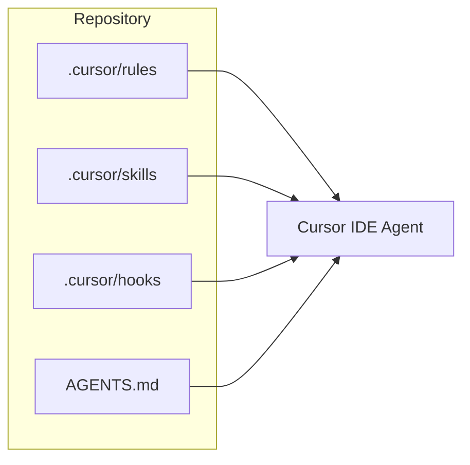

# Architecture (example)

This document is referenced by `AGENTS.md` and rules as an example of deeper project docs.

## System context

The Cursor workspace template has no runtime services. Configuration lives under `.cursor/` and is consumed by the Cursor IDE.

## Configuration layers

| Layer | Role |
|-------|------|
| Rules | Always-on or file-scoped coding standards |
| Skills | On-demand workflows |
| Hooks | Event-driven scripts |
| AGENTS.md | Repo-wide agent orientation |

Replace this file with real architecture when you fork the template for an application.
